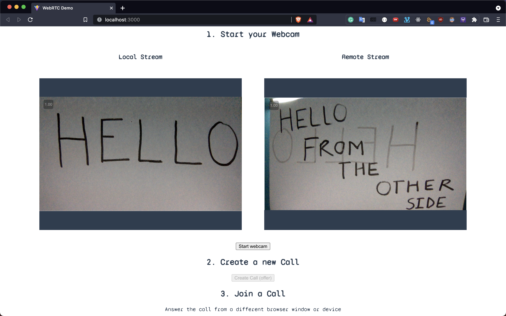
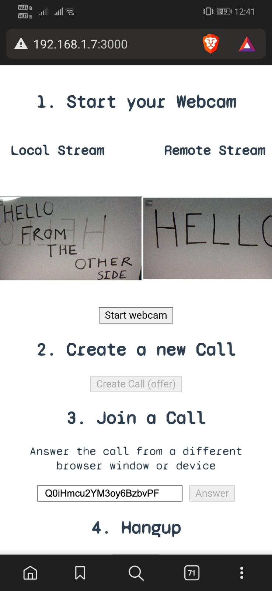

# Video Chat with WebRTC and Firebase

A 1-to-1 video chat feature build with WebRTC, Firestore, and JavaScript. 


## Usage

Update the firebase project config in the main.js file. 

```
git clone <this-repo>
npm install

npm run dev
```
## Demo 

1st Client Image

<br>


2nd Client Image

<br>


